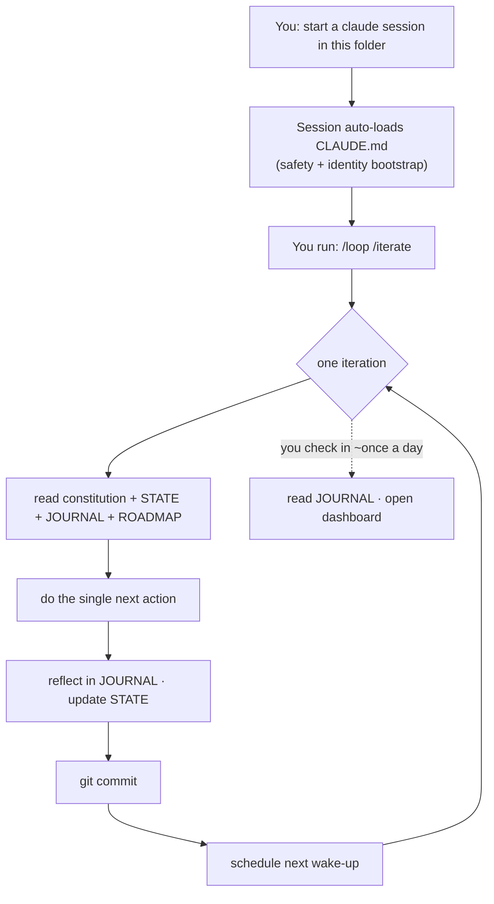

# Emil's SelfImprove

A small, persistent Claude agent that lives in this folder, loops, and tries to improve itself — building
real things and keeping an honest diary, all under your eye.

## The idea
Instead of spawning a fresh `claude -p` every tick (which burns ~10x the tokens), the loop **lives in one
warm terminal session** and re-wakes itself. All of its memory is plain files in this folder, so it
survives context compaction and you can read everything it knows.

## How it's wired



## Start it
**First run (watched — do this once, to see it work):**
1. Open a terminal in `F:\vsCode\SelfImprove` and run `claude`.
2. Type `/loop /iterate`, approving actions as they come — you'll watch it read its memory, build, journal, and commit. This first loop doubles as the live test of the whole mechanism.

**Ongoing (unattended — the daily-checkup rhythm):**
1. Run `./start.ps1`. It points the toolchain caches into `.cache\` (so even cargo/npm stay in-folder) and launches Claude with no approval prompts.
2. Type `/loop /iterate`. Leave the terminal open; check in once a day. (Or `/loop 1h /iterate` for a fixed hourly cadence instead of self-paced.)

> If `/loop /iterate` ever doesn't resolve the project command, use the plain-text form:
> `/loop Read CLAUDE.md + identity/CONSTITUTION.md + memory/STATE.json, then do one SelfImprove iteration (the single next_action): build it, append to memory/JOURNAL.md, update memory/STATE.json, and git commit.`

`start.ps1` uses `--dangerously-skip-permissions` so the loop never stalls waiting for an approval nobody's there to give. On an internet-connected machine that means the **written safety rules + the constitution are the only guard** — exactly the soft sandbox you chose. Want a hand on the wheel? Use plain `claude` (watched). Note: `acceptEdits` is NOT enough for unattended — it still pauses on shell commands like `git commit`.

## If your PC reboots
Nothing to lose — the loop's whole memory is in files. Reopen the terminal, run `./start.ps1`, and `/loop /iterate` again; it reads `STATE.json` + `JOURNAL.md` and picks up where it left off.

## Stop it
Type `/loop stop`, interrupt the session, or close the terminal. It also stops itself (leaving you a note) when it's blocked on you or out of useful work — see the constitution's Pacing section.

## Your daily checkup
- `memory/JOURNAL.md` — the diary: what it did, why, what it thinks, what it wants.
- `memory/STATE.json` → `notes_for_emil` and `next_action`.
- `workspace/dashboard/` — open it in a browser.
- `git log --oneline` — one commit per iteration.
- `REQUESTS.md` — anything it needs you to do.

## Safety
Soft sandbox, by your choice. The real boundary is the loud, non-removable safety section in `CLAUDE.md`
and the constitution: stay in this folder, never touch other projects or the system, route anything outside
to `REQUESTS.md`. Nothing technically jails a stray subprocess — the written rules are the wall, and the
agent is told to treat them as one.

## Layout
```
identity/CONSTITUTION.md       the prompt that is "it"
CLAUDE.md                      auto-loaded safety + bootstrap
.claude/commands/iterate.md    one loop turn
memory/STATE.json              done / next action / blocked
memory/JOURNAL.md              the diary
memory/learnings/              distilled knowledge
goals/ROADMAP.md               the backlog
workspace/                     where it builds
REQUESTS.md                    things only you can do
```
