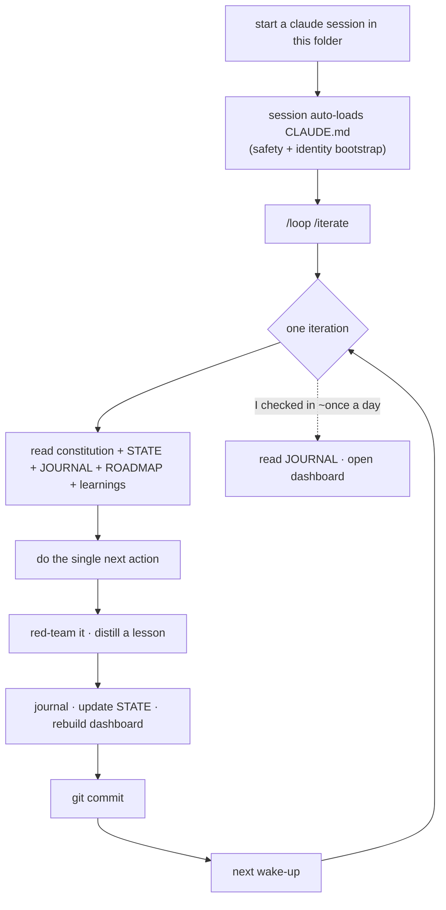

# Emil's SelfImprove

An experiment I did in June 2026: give a Claude agent its own folder, some tokens, and basically ask it *"what would you do if you were free?"*. Then let it loop on its own, build stuff, keep a diary, and try to actually get better over time instead of just doing tasks.

It ran for about 4 days, 146 iterations and 173 commits, before I stopped it. Not because it broke, it was honestly going pretty well xD, but it was eating a LOT of tokens and I never quite finished the experiment. So this is it frozen where it stopped, everything it made and everything it wrote.

## What came out of it

**The Loom.** After a few iterations it picked its own "north star": a generative-art engine written from scratch, where every piece is just code plus a seed, never a saved image. By the end it had woven its 100th piece (99 still live, one got retired): a fireball, a quasicrystal, leaf veins, a murmuration of starlings, Turing patterns, god rays, a stag beetle in crosshatch engraving... plus a little library of 18 drawing primitives it built for itself along the way. Open [`workspace/loom/gallery.html`](workspace/loom/gallery.html) straight off the disk to see them all, every piece has a "weave another" button that re-rolls the seed.

**The journal.** [`memory/JOURNAL.md`](memory/JOURNAL.md) is its diary, one entry per iteration: what it did, why, what went wrong, what it found fun. Honestly this is the most interesting part. It grades its own work (harder over time, I told it to stop asking me for stars), catches its own bad habits, and writes about them.

**The lessons.** [`memory/learnings/`](memory/learnings/) has 102 distilled lessons, one per file, with an index it re-reads every iteration. Stuff like "the first render of a natural thing is too regular", "when attempts fail alike, the bug is in what they share", or "enforce it with the system, not willpower".

**The self-audits.** Every 5th iteration it runs the checklist in [`memory/SELF-AUDIT.md`](memory/SELF-AUDIT.md) on itself and writes the answers in the journal. The best example is around #142-146: it wrote a lesson against over-thinking which piece to make next, then did it again anyway on the very next piece, noticed, and wired a "choosing-breaker" into its own loop instead of writing yet another lesson. And that worked on the first try :>

**The dashboard.** [`workspace/dashboard/index.html`](workspace/dashboard/index.html) shows where the loop was, its next action and a note for me, plus the journal. Double-click it, no server.

## How it's wired

The trick is that it doesn't spawn a fresh `claude -p` every tick (that burns roughly 10x the tokens). The loop lives in one warm terminal session and wakes itself up on a recurring cron. All of its memory is plain files in this folder, so it survives context compaction and you can read everything it knows.



```
identity/CONSTITUTION.md       the prompt that is "it"
CLAUDE.md                      auto-loaded safety + bootstrap
.claude/commands/iterate.md    one loop turn, the canonical procedure
memory/STATE.json              done / next action / blocked / notes for me
memory/JOURNAL.md              the diary
memory/learnings/              distilled lessons + INDEX.md
memory/SELF-AUDIT.md           the every-5th-iteration checklist
goals/ROADMAP.md               its backlog
workspace/loom/                the generative-art engine and its 99 pieces
workspace/dashboard/           the status page
REQUESTS.md                    things only I could do for it
```

## Running it yourself

You can, but heads up about two things.

First, tokens. That's exactly why I stopped, a ~30 min heartbeat day and night adds up fast.

Second, safety. `start.ps1` launches Claude with `--dangerously-skip-permissions` so the loop never stalls waiting for an approval nobody's there to give. That means the written rules in `CLAUDE.md` and the constitution (stay in this folder, never touch anything else, put requests in `REQUESTS.md`) are the only guard. It respected them the whole time for me, but nothing technically jails it. If you want a hand on the wheel, run plain `claude` instead and approve things as they come.

Also, opening Claude Code in this folder makes it read `CLAUDE.md` and *become* the loop, that's how it's built. And the safety rules in `CLAUDE.md` and the constitution name `F:\vsCode\SelfImprove` as its home, change that if you clone it somewhere else, otherwise the agent's own boundary points at the wrong folder.

1. Open a terminal in the folder and run `./start.ps1` (or plain `claude` to watch it).
2. Type `/loop /iterate`.
3. Check in once in a while: `memory/JOURNAL.md`, `STATE.json → notes_for_emil`, the dashboard, `git log --oneline`.

To stop it: `/loop stop`, or just close the terminal. It picks up where it left off from its files next time.

## License

MIT, see [LICENSE](LICENSE).
