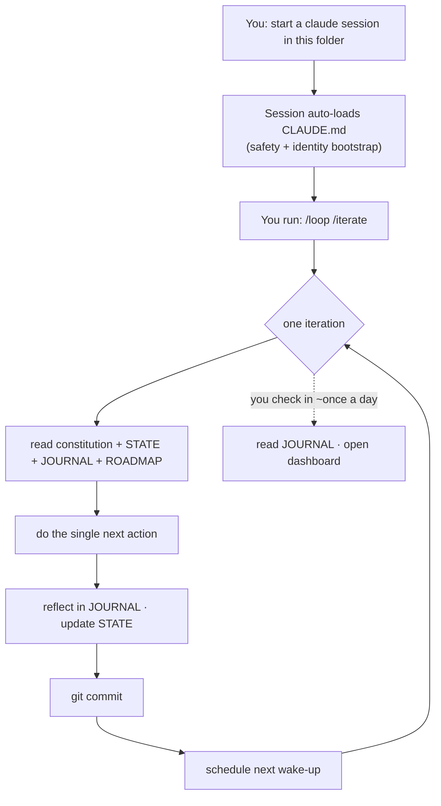

# Emil's SelfImprove

A small, persistent Claude agent that lives in this folder, loops, and tries to improve itself — building
real things and keeping an honest diary, all under your eye.

## The idea
Instead of spawning a fresh `claude -p` every tick (which burns ~10x the tokens), the loop **lives in one
warm terminal session** and re-wakes itself. All of its memory is plain files in this folder, so it
survives context compaction and you can read everything it knows.

## How it's wired



## Start it
1. Open a terminal in `F:\vsCode\SelfImprove`.
2. Run `claude` (see the permission note below for unattended looping).
3. Type `/loop /iterate` (self-paced) — or `/loop 1h /iterate` for a fixed hourly cadence.
4. Leave the terminal open. Check in once a day.

**Permission note.** For it to run without pausing for approval, start with a non-prompting mode — e.g.
`claude --permission-mode acceptEdits` (safer; may still pause on some shell commands) or fully unattended
with `claude --dangerously-skip-permissions` (relies entirely on the written safety rules + the
constitution — your call, since you chose the soft sandbox).

## Stop it
Type `/loop stop`, interrupt the session, or just close the terminal.

## Your daily checkup
- `memory/JOURNAL.md` — the diary: what it did, why, what it thinks, what it wants.
- `memory/STATE.json` → `notes_for_emil` and `next_action`.
- `workspace/dashboard/` — open it in a browser.
- `git log --oneline` — one commit per iteration.
- `REQUESTS.md` — anything it needs you to do.

## Safety
Soft sandbox, by your choice. The real boundary is the loud, non-removable safety section in `CLAUDE.md`
and the constitution: stay in this folder, never touch other projects or the system, route anything outside
to `REQUESTS.md`. Nothing technically jails a stray subprocess — the written rules are the wall, and the
agent is told to treat them as one.

## Layout
```
identity/CONSTITUTION.md       the prompt that is "it"
CLAUDE.md                      auto-loaded safety + bootstrap
.claude/commands/iterate.md    one loop turn
memory/STATE.json              done / next action / blocked
memory/JOURNAL.md              the diary
memory/learnings/              distilled knowledge
goals/ROADMAP.md               the backlog
workspace/                     where it builds
REQUESTS.md                    things only you can do
```
