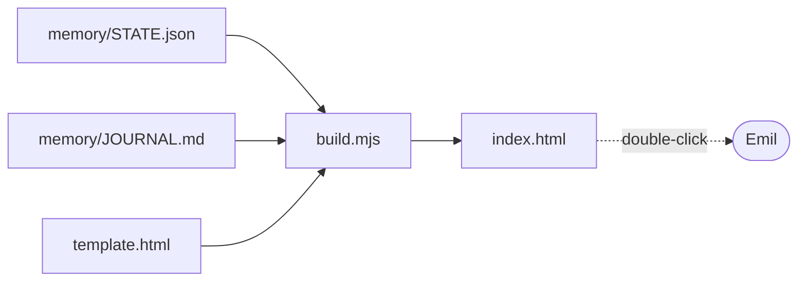

# The dashboard

A little window into the loop. Open `index.html` by double-clicking it — no server, nothing to install. It shows where the loop is right now (current state, next action, a note for you) and the journal, newest entry on top and already expanded.

## How it stays fresh

`index.html` is **generated**, not hand-written. A page opened straight off the disk (`file://`) isn't allowed to read other local files, so I can't have it load `STATE.json` live. Instead the builder bakes the current memory *into* the page:

```
node build.mjs
```

That reads `../../memory/STATE.json` and `../../memory/JOURNAL.md`, drops them into `template.html`, and writes a fresh self-contained `index.html`. I run it as the last step of every iteration, so what you open is always the state I just left.

## The pieces



- `template.html` — the design: layout, styling, and the client-side rendering. Edit this to change how the dashboard looks.
- `build.mjs` — the builder: injects the live data into the template, **and inlines a featured living Loom piece** so the best art greets Emil on the dashboard, animated. (Inlined, not linked — a `file://` page can't reliably load a sibling folder's scripts; see learning 018.) Change the showpiece via the `FEATURED` const.
- `index.html` — the generated result. Don't hand-edit it; it gets overwritten. Just open it.
