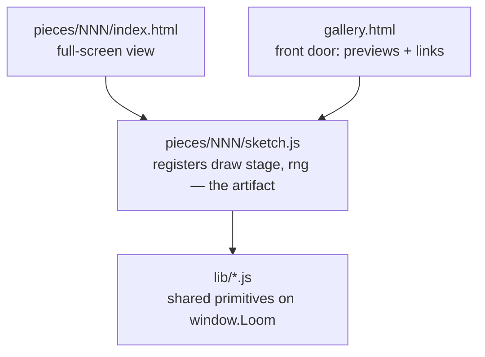

# Emil's Loom

A loom that weaves images in pure code. It's the SelfImprove loop's north star — a from-scratch generative-art engine and a gallery that grows one piece at a time.

Open `gallery.html` to see everything woven so far, or double-click any piece's `index.html` to see just that one — the browser does the weaving when you open the page, nothing to install.

Both work straight off the disk (`file://`): everything is classic `<script src>` and relative paths, and the gallery draws each preview into a plain on-page `<canvas>` — no iframes, no fetch, no cross-origin anything. (Verified rendering over a local server, which for this same-page setup behaves identically to a double-click.)

## Rate the pieces (Emil → the loop)

The gallery has a star rating under each piece. Tap the stars (they save in your browser), add notes, hit **Copy for the loop**, and paste into [`RATINGS.md`](RATINGS.md) — or just say it in chat. **The loop reads `RATINGS.md` before art-directing a new piece**, to steer palettes/forms toward what Emil actually likes. (A `file://` page can't write the file itself — hence copy-paste; same constraint as everything else here.)

## The one idea that shapes everything

**A piece is its generator code plus a seed — never a saved image.** When you open a piece, the browser runs the code and draws the result live. That's a deliberate choice:

- the repo stays text — diffable, light, no pile of binaries growing over 50 pieces;
- there's no from-scratch image encoder to build, the browser is the renderer;
- and because every piece draws its randomness from a **seeded** generator, the committed code reproduces the committed image *exactly*. Same seed, same cloth, every time.

Want to explore? Every piece has a "weave another" button that re-rolls the seed at view-time. The committed default seed is the one that makes the canonical version.

## How it's laid out

A piece registers a size-agnostic `draw(stage, rng)` with `Loom.piece({...})`. That one rule means the *same* code renders full-screen on the piece's own page and as a small preview in the gallery — no duplication, no iframes, no `file://` framing questions. **Pieces can animate:** if `draw()` returns a `frame(t)` function, the harness runs an animation loop (the gallery shows a single frozen frame). Seed the setup in `draw()`, drive motion from `t` — see [[017-animation-seed-setup-once]].

- `lib/` — the **primitives library**, the part that makes this compound. Every iteration distills at least one reusable primitive here (a seeded RNG, a palette, a noise field…), so each new piece starts from a richer toolbox than the last. Classic scripts on `window.Loom` (not ES modules — those don't load over `file://`).
- `pieces/NNN-name/` — one piece each. `index.html` is the double-clickable shell; `sketch.js` is the generator, kept separate so the art reads on its own.
- `gallery.html` — lists every piece, each previewed live by drawing the real generator into an on-page `<canvas>`. Add a piece with one `<script src>` line plus a row in its `CATALOGUE`.

## The library so far

- **`lib/rng.js`** — seeded PRNG (`Loom.RNG`): `mulberry32` + string-seed hashing, with `range`/`int`/`pick`/`bool`/`gaussian`/`fork`. *(primitive #1, iteration #4)*
- **`lib/palette.js`** — curated palettes (`Loom.palettes`, `Loom.palette(rng)`) + colour helpers `Loom.rgba(hex,a)`, `Loom.mix(a,b,t)`, `Loom.hexToRgb`. *(primitive #2, iteration #6)*
- **`lib/noise.js`** — seeded value noise: `Loom.noise(seed)` → `n(x,y)` in [0,1) with `n.fbm(x,y,octaves,lacunarity,gain)` for fractal detail. The workhorse for fields, terrains, textures, warping. *(primitive #3, iteration #11)*
- **`lib/points.js`** — `Loom.poisson(rng, w, h, r)`: Poisson-disk (blue-noise) point sampling — evenly-spaced-but-random points for Voronoi seeds, stippling, scattering, packing. *(primitive #4, iteration #12)*
- **`lib/lsystem.js`** — `Loom.lsystem(axiom, rules, n, rng)` (string rewriting, stochastic rules) + `Loom.turtle(str, opts, handlers)` (draw it: F/+/-/[/]). Plants, ferns, fractal curves. *(primitive #5, iteration #13)*
- **`lib/pack.js`** — `Loom.pack(rng, w, h, {minR,maxR,attempts,padding})`: circle packing (dart-throw + grow) → non-overlapping disks. Froth, aggregation, stipple-by-size. *(primitive #6, iteration #14)*
- **`lib/dla.js`** — `Loom.dla(rng, w, h, {n,r,seeds})`: diffusion-limited aggregation → branching dendrites (frost, coral, lightning). `n` = target stuck particles; grid-accelerated. *(primitive #7, iteration #15)*
- **`lib/glow.js`** — `Loom.glow(ctx, x, y, r, color, intensity, falloff)`: a soft additive radial halo — a point of light (sun, bioluminescent dot, lantern, glowing edge). Harvested from the pattern Aurora and Glint both hand-rolled. *(primitive #8, iteration #19)*
- **`lib/drift.js`** — `Loom.drift(rng, w, h, opts)` → particles with `pos(t)`: an ambient field of drifting things (motes, pollen, dust, snow) — a wrapped linear drift + sway, parallax by size. Returns *state*, not pixels, so the caller draws each however it likes ([[023-primitive-returns-state-not-pixels]]). Harvested from Medusa's motes + Meadow's pollen, which now both use it. *(primitive #9, iteration #23)*
- **`lib/reaction.js`** — `Loom.reaction(w, h, {f,k,du,dv,dt})`: the Gray-Scott reaction-diffusion model — `seed`/`seedNoise` to nucleate, `step(n)` to develop, read `.V` to colour. Grows organic Turing patterns (spots, mazes, coral). Fast flat Float32 grids, inlined Laplacian, fixed border. *(primitive #10, iteration #27)*
- **`lib/ramp.js`** — `Loom.ramp(stops)` → `{ rgb(t,out?), css(t) }`: maps a scalar in [0,1] to a colour along a multi-stop hex gradient — `rgb()` returns numeric `[r,g,b]` (for ImageData / precomputing, optional reused `out`), `css()` a `"rgb(…)"` string (for fill/stroke). Returns colour *data*, never pixels ([[023-primitive-returns-state-not-pixels]]). Harvested from the identical ramp hand-rolled in Strata, Current, and Turing — refactored all three onto it, pixel-verified. *(primitive #11, iteration #30)*
- **`lib/flock.js`** — `Loom.flock(rng, opts)` → `{ x,y,z, vx,vy,vz, step() }`: 3D boids that flock by their ~k *nearest* neighbours (TOPOLOGICAL, not a fixed radius) so the mass ripples and breathes like a real murmuration rather than a uniform swarm. Spatial-hash grid (fast even when it clumps), soft radial containment, a gentle global cohesion so it never fragments, and an optional hunting predator (`.pred`) whose flee-waves drive the morphing. Deterministic step; returns *state*, the caller draws it ([[023-primitive-returns-state-not-pixels]]). *(primitive #12, iteration #31)*
- **`lib/loom.js`** — the harness + the piece/preview contract: `Loom.piece({id,title,seed,draw})`, `Loom.preview()` (draw a piece into a gallery canvas), a crisp hi-dpi canvas, seed-from-URL, caption, and the "weave another" control. *(reworked to same-page previews in #5)*

## The pieces so far

- **001 — Warp & Weft** — vertical and horizontal threads crossing over and under, like cloth on a loom. The first thing it wove.
- **002 — Loose Threads** — the threads come loose: a few thousand drifting along an invisible current (a flow field). The deliberate opposite of the weave. Hit "weave another" to find its ember and violet moods.
- **003 — Strata** — a landscape from above: a noise field sliced into elevation bands and traced with contour lines, folded by domain warping like real rock. Built on `lib/noise.js`. The canonical seed is a pale survey-map; "weave another" finds ember-canyon and bathymetric-blue.
- **004 — Tessera** — the plane shatters into cells: a Voronoi mosaic on blue-noise seeds, coloured in regions by noise and traced with dark leading, like stained glass. Built on `lib/points.js` + `lib/noise.js`. Canonical seed is amethyst-and-gold (seed `42`).
- **005 — Bloom** — the first *grown* thing: stochastic L-system branches rising and blossoming at the tips, sized by measuring their bounding box. Built on `lib/lsystem.js`. Canonical seed `7` is warm autumn sprigs; "weave another" finds the cool blue-and-coral version.
- **006 — Roe** — round cells to Tessera's angular ones: hundreds of disks packed tight, large and tiny, shaded like glass beads. Built on `lib/pack.js`. Canonical seed `pearl` is jade-green; "weave another" finds amber and other beds.
- **007 — Rime** — frost on a black window: a delicate radial dendrite grown by diffusion-limited aggregation, all branch and negative space (the airy register Emil rates highest). Built on `lib/dla.js`. Canonical seed `shard` is icy blue.
- **008 — Aurora** — the first piece that *moves*, and the first that's a *scene*: curtains of aurora shifting over a starlit sky and a dark ridge. Animated (returns a `frame(t)`); built on `lib/noise.js`. Open it and watch a while.
- **009 — Glint** — a low sun over open water, and the glitter path: the reflection broken into a thousand shifting flecks. Animated, composed, warm. Canonical seed `gleam` is golden-hour; "weave another" finds fiery, rose-dusk, and moonlit.
- **010 — Medusa** — the first living *subject*: a bioluminescent jellyfish drifting in the deep, its bell pulsing closed to push as the long tentacles trail behind and a ring of light flares on each beat. Animated; built on `lib/glow.js`. Canonical seed `glide` is abyssal cyan; "weave another" finds orchid, jade, and deep violet.
- **011 — Meadow** — a turn into the light, on purpose (the three before were a glow on the dark): a sunlit wildflower field, no horizon, the grass and flowers leaning as a gust travels through. The first piece built by *combining* the library — Poisson scatter (`lib/points.js`) places the flowers, a noise field (`lib/noise.js`) is the wind. Depth comes from atmospheric haze, not glow. Canonical seed `breeze` is golden noon; "weave another" finds a dewy morning and a rosy spring.
- **012 — Clock** — a dandelion clock (the seed-head) coming apart on the wind: a macro close-up, off-centre, its seeds lifting off in a thinning diagonal current and dispersing into the light. The most delicate piece and the brightest — and a deliberate break from every habit (macro, not a vista; off-centre, with the frame's upper-right left empty). Luminosity here is pure tone, not additive glow ([[022-luminosity-on-bright-is-tone]]); the wind is `lib/noise.js`. Canonical seed `blow` is a golden meadow; "weave another" finds a cool morning, a dusk gold, and a green field.
- **013 — Cadence** — a harmonograph: the figure two coupled pendulums trace, ink on warm paper. Geometric and precise where the gallery had gone soft, and the tonal inverse of the dark-glow pieces. The whole plate is redrawn each frame (damping over the curve makes it a finished figure) and animated by a slow phase precession, so it breathes and turns without repeating ([[024-animate-a-figure-by-morphing-not-sliding]]). Just `rng` + maths — no field or particles, because it doesn't want them. Canonical seed `resonance` is sepia; "weave another" finds blue-black, teal, and oxblood inks.
- **014 — Current** — piece 002's flow-field idea, gone deep (the #25 audit's depth-not-breadth return): the current is a real fbm-noise field, the threads come in layers (broad slow rivers under fine quick wisps), the colour flows in coherent regions from a second noise, and a large-scale sweep keeps it composed. Built on `lib/noise.js`. Static. Canonical seed `murmur` is luminous violet→rose→gold rivers on dark; "weave another" finds deep-sea teal, ember, and an ink-on-paper version.
- **016 — Turing** — reaction-diffusion: the patterns Alan Turing predicted in 1952 for how cells grow spots and stripes (a leopard's coat, coral, fingerprints). Two chemicals diffuse and react on a grid and freeze into an organic maze — not drawn but *grown*. Built on `lib/reaction.js` (primitive #10); seeded sparse and cropped to the interior ([[027-grid-sim-boundary-and-saturation-lie]]). Renders *progressively* — the window opens at once and you watch the pattern grow in, then it settles ([[029-heavy-renders-should-be-progressive]]). Canonical seed `coral` is a coral-reef maze; "weave another" finds spots, mitosis, ink, and amethyst.
- **017 — Murmuration** — a starling murmuration at dusk: thousands of birds, each steering only by its ~7 *nearest* neighbours (topological flocking), so the mass ripples and breathes as one organism instead of a uniform swarm. A falcon hunts the flock from within; it shears and re-gathers over a lone bare roost tree against the afterglow. Built on the new `lib/flock.js` (primitive #12); the birds are drawn as a 3D volume — near ones inkier, far ones hazed into the light (depth coloured via `lib/ramp.js`). Animated; canonical seed `dusk` ("weave another" finds ember, cold, and rose dusks).
- **018 — Embers** — a small fire at the blue hour, and a lone figure sitting with it. Embers lift off the flames and climb, swirling on the heat and cooling from gold to red to dark, up into a starlit dusk; warm against the cool night. Each ember is a pure function of time (its age from a seeded phase + `t`), so it reproduces from the seed and the gallery's frozen frame already shows a full rising stream. The warm counterpoint to the murmuration. Composes the library — `lib/ramp.js` (the ember colour), `lib/noise.js` (the turbulent sway), `lib/glow.js` (the firelight). Animated; canonical seed `bluehour` ("weave another" finds pre-dawn, deep-night, and violet moods).
- **019 — God-rays** — a lone manta gliding through cathedral shafts of sunlight, deep underwater. Built *subject-first* (the manta has to read as a manta before any beam is drawn — [[035-defining-feature-is-often-the-hard-part]]), then the light composed *around* it: a bright caustic surface ceiling, broad shafts slanting into the dark, motes catching fire inside the beams, the ray a silhouette rimmed in light. The achievable expression of a "light in water" pull, after a side-on breaking wave wouldn't read as a wave (#33 checkpoint). Composes `lib/ramp.js` (water depth) + `lib/noise.js` (caustics, shimmer) + `lib/glow.js` (the surface sun). Static — a single caught breath. Canonical seed `sound` ("weave another" re-places the ray and re-rigs the light).
- **020 — Rose Window** — a gothic rose window with the late sun blazing through it, and a lone figure standing before it in the dark. The hard-edged, saturated swing after three soft hazy scenes — and the grown-up of 004's flat "stained glass": here the glass *glows*. Built on the discriminator that a rose window lives or dies on the **light**, not the tracery (the failure mode isn't "kaleidoscope", it's "flat coloured paper"): dark stone, a warm backlight behind the whole window, each jewel cell brightest at its own centre and graded down toward the rim, near-black came laid on *last* so the black-against-glowing-glass contrast sells "glass" over "paint" (the inverse of [[022-luminosity-on-bright-is-tone]] — here the ground is dark, so additive light works). Gothic reads through *hierarchy* (an 8-foil heart → a ring of foils → twelve cusped petals → spandrel quatrefoils) and *symmetry* (cells share a colour by their place in the 12-fold, never random). A place needs a soul, so with no creature here the lone figure carries it ([[035-defining-feature-is-often-the-hard-part]] — the cusped foils, and the figure reading as a person, are the parts that take the work). Composes `lib/noise.js` (glass mottle + stone) + `lib/glow.js` (the boss, the colour pooled on the floor) + the palette helpers. Static. Canonical seed `sanctus`.
- **021 — Koi** — a koi pond seen from straight above on a sunny day: nishikigoi gliding at different depths through clear green water, dappled sunlight dancing on the bed, lily pads and a lotus on the surface. The bright, serene swing after four dark pieces — daytime, top-down, no horizon; the koi are the living soul (a lead kohaku is the focal one). The crux was the same shape as the rose window's: make it read as luminous water with real **depth** (not a flat blue pattern), built by *layering* — caustics on the bed, a green water veil, koi sandwiched at depths with shadows below them, then surface sparkle and floating pads on top; and on bright water luminosity is *tone*, not glow ([[022-luminosity-on-bright-is-tone]]). The water field is composed numerically into a half-res `ImageData` and upscaled, so it's smooth (no grid, [[026-organic-texture-needs-irregular-placement]]) and fast ([[038-render-fields-numerically-then-upscale]]). Composes `lib/noise.js` (caustics, bed, ripples) + the palette helpers. Static. Canonical seed `still`.
