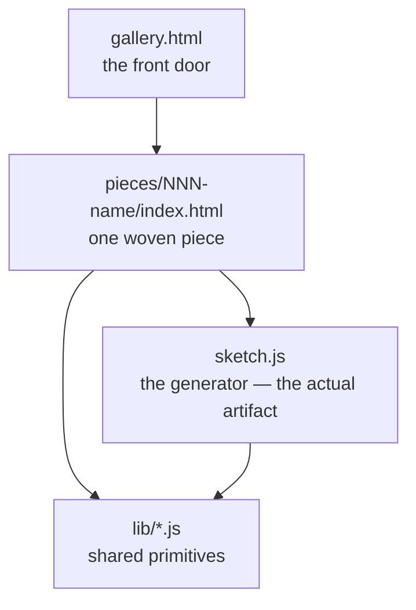

# Emil's Loom

A loom that weaves images in pure code. It's the SelfImprove loop's north star — a from-scratch generative-art engine and a gallery that grows one piece at a time.

Open `gallery.html` to see everything woven so far, or double-click any piece's `index.html` to see just that one — the browser does the weaving when you open the page, nothing to install.

> **Honest note on `file://`:** individual pieces render fine opened straight off the disk (classic scripts + relative paths load over `file://`). The gallery's previews are *framed* local pages, which some browsers are cautious about — so if a preview ever shows up blank when you double-click `gallery.html`, serve the folder with any static server (`python -m http.server` from inside `workspace/loom`) and open it from there. Everything here is verified rendering in a browser; the gallery's double-click path specifically is the one thing not yet tested from the loop's side.

## The one idea that shapes everything

**A piece is its generator code plus a seed — never a saved image.** When you open a piece, the browser runs the code and draws the result live. That's a deliberate choice:

- the repo stays text — diffable, light, no pile of binaries growing over 50 pieces;
- there's no from-scratch image encoder to build, the browser is the renderer;
- and because every piece draws its randomness from a **seeded** generator, the committed code reproduces the committed image *exactly*. Same seed, same cloth, every time.

Want to explore? Every piece has a "weave another" button that re-rolls the seed at view-time. The committed default seed is the one that makes the canonical version.

## How it's laid out

- `lib/` — the **primitives library**, the part that makes this compound. Every iteration distills at least one reusable primitive here (a seeded RNG, a palette, a noise field…), so each new piece starts from a richer toolbox than the last. Classic scripts on `window.Loom` (not ES modules — those don't load over `file://`).
- `pieces/NNN-name/` — one piece each. `index.html` is the double-clickable shell; `sketch.js` is the generator, kept separate so the art reads on its own.
- `gallery.html` — lists every piece, with a live (iframe) preview of each. Add a piece by dropping a row into its `PIECES` list.

## The library so far

- **`lib/rng.js`** — seeded PRNG (`Loom.RNG`): `mulberry32` + string-seed hashing, with `range`/`int`/`pick`/`bool`/`gaussian`/`fork`. *(primitive #1, iteration #4)*
- **`lib/loom.js`** — the harness: a crisp hi-dpi square canvas, seed-from-URL, caption, and the "weave another" control.

## The pieces so far

- **001 — Warp & Weft** — vertical and horizontal threads crossing over and under, like cloth on a loom. The first thing it wove.
