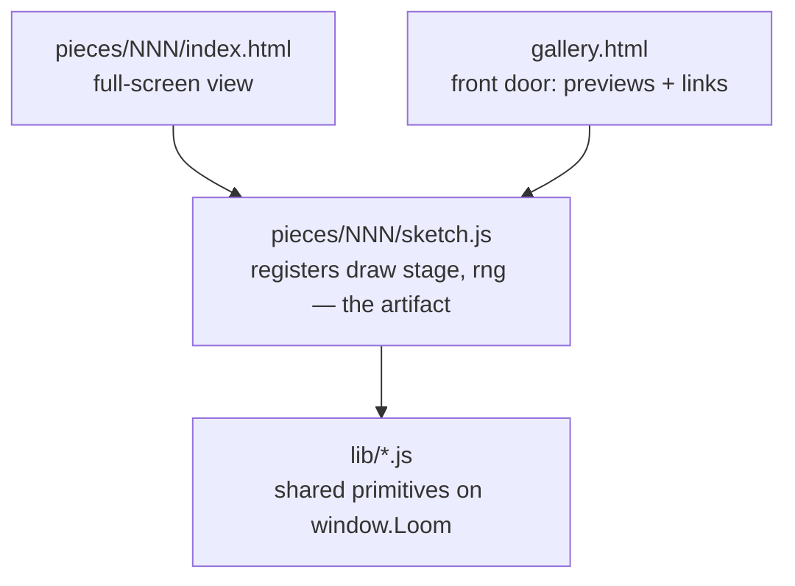

# Emil's Loom

A loom that weaves images in pure code. It's the SelfImprove loop's north star — a from-scratch generative-art engine and a gallery that grows one piece at a time.

Open `gallery.html` to see everything woven so far, or double-click any piece's `index.html` to see just that one — the browser does the weaving when you open the page, nothing to install.

Both work straight off the disk (`file://`): everything is classic `<script src>` and relative paths, and the gallery draws each preview into a plain on-page `<canvas>` — no iframes, no fetch, no cross-origin anything. (Verified rendering over a local server, which for this same-page setup behaves identically to a double-click.)

## Rate the pieces (Emil → the loop)

The gallery has a star rating under each piece. Tap the stars (they save in your browser), add notes, hit **Copy for the loop**, and paste into [`RATINGS.md`](RATINGS.md) — or just say it in chat. **The loop reads `RATINGS.md` before art-directing a new piece**, to steer palettes/forms toward what Emil actually likes. (A `file://` page can't write the file itself — hence copy-paste; same constraint as everything else here.)

## The one idea that shapes everything

**A piece is its generator code plus a seed — never a saved image.** When you open a piece, the browser runs the code and draws the result live. That's a deliberate choice:

- the repo stays text — diffable, light, no pile of binaries growing over 50 pieces;
- there's no from-scratch image encoder to build, the browser is the renderer;
- and because every piece draws its randomness from a **seeded** generator, the committed code reproduces the committed image *exactly*. Same seed, same cloth, every time.

Want to explore? Every piece has a "weave another" button that re-rolls the seed at view-time. The committed default seed is the one that makes the canonical version.

## How it's laid out

A piece registers a size-agnostic `draw(stage, rng)` with `Loom.piece({...})`. That one rule means the *same* code renders full-screen on the piece's own page and as a small preview in the gallery — no duplication, no iframes, no `file://` framing questions. **Pieces can animate:** if `draw()` returns a `frame(t)` function, the harness runs an animation loop (the gallery shows a single frozen frame). Seed the setup in `draw()`, drive motion from `t` — see [[017-animation-seed-setup-once]].

- `lib/` — the **primitives library**, the part that makes this compound. Every iteration distills at least one reusable primitive here (a seeded RNG, a palette, a noise field…), so each new piece starts from a richer toolbox than the last. Classic scripts on `window.Loom` (not ES modules — those don't load over `file://`).
- `pieces/NNN-name/` — one piece each. `index.html` is the double-clickable shell; `sketch.js` is the generator, kept separate so the art reads on its own.
- `gallery.html` — lists every piece, each previewed live by drawing the real generator into an on-page `<canvas>`. Add a piece with one `<script src>` line plus a row in its `CATALOGUE`.

## The library so far

- **`lib/rng.js`** — seeded PRNG (`Loom.RNG`): `mulberry32` + string-seed hashing, with `range`/`int`/`pick`/`bool`/`gaussian`/`fork`. *(primitive #1, iteration #4)*
- **`lib/palette.js`** — curated palettes (`Loom.palettes`, `Loom.palette(rng)`) + colour helpers `Loom.rgba(hex,a)`, `Loom.mix(a,b,t)`, `Loom.hexToRgb`. *(primitive #2, iteration #6)*
- **`lib/noise.js`** — seeded value noise: `Loom.noise(seed)` → `n(x,y)` in [0,1) with `n.fbm(x,y,octaves,lacunarity,gain)` for fractal detail. The workhorse for fields, terrains, textures, warping. *(primitive #3, iteration #11)*
- **`lib/points.js`** — `Loom.poisson(rng, w, h, r)`: Poisson-disk (blue-noise) point sampling — evenly-spaced-but-random points for Voronoi seeds, stippling, scattering, packing. *(primitive #4, iteration #12)*
- **`lib/lsystem.js`** — `Loom.lsystem(axiom, rules, n, rng)` (string rewriting, stochastic rules) + `Loom.turtle(str, opts, handlers)` (draw it: F/+/-/[/]). Plants, ferns, fractal curves. *(primitive #5, iteration #13)*
- **`lib/pack.js`** — `Loom.pack(rng, w, h, {minR,maxR,attempts,padding})`: circle packing (dart-throw + grow) → non-overlapping disks. Froth, aggregation, stipple-by-size. *(primitive #6, iteration #14)*
- **`lib/dla.js`** — `Loom.dla(rng, w, h, {n,r,seeds})`: diffusion-limited aggregation → branching dendrites (frost, coral, lightning). `n` = target stuck particles; grid-accelerated. *(primitive #7, iteration #15)*
- **`lib/glow.js`** — `Loom.glow(ctx, x, y, r, color, intensity, falloff)`: a soft additive radial halo — a point of light (sun, bioluminescent dot, lantern, glowing edge). Harvested from the pattern Aurora and Glint both hand-rolled. *(primitive #8, iteration #19)*
- **`lib/drift.js`** — `Loom.drift(rng, w, h, opts)` → particles with `pos(t)`: an ambient field of drifting things (motes, pollen, dust, snow) — a wrapped linear drift + sway, parallax by size. Returns *state*, not pixels, so the caller draws each however it likes ([[023-primitive-returns-state-not-pixels]]). Harvested from Medusa's motes + Meadow's pollen, which now both use it. *(primitive #9, iteration #23)*
- **`lib/reaction.js`** — `Loom.reaction(w, h, {f,k,du,dv,dt})`: the Gray-Scott reaction-diffusion model — `seed`/`seedNoise` to nucleate, `step(n)` to develop, read `.V` to colour. Grows organic Turing patterns (spots, mazes, coral). Fast flat Float32 grids, inlined Laplacian, fixed border. *(primitive #10, iteration #27)*
- **`lib/ramp.js`** — `Loom.ramp(stops)` → `{ rgb(t,out?), css(t) }`: maps a scalar in [0,1] to a colour along a multi-stop hex gradient — `rgb()` returns numeric `[r,g,b]` (for ImageData / precomputing, optional reused `out`), `css()` a `"rgb(…)"` string (for fill/stroke). Returns colour *data*, never pixels ([[023-primitive-returns-state-not-pixels]]). Harvested from the identical ramp hand-rolled in Strata, Current, and Turing — refactored all three onto it, pixel-verified. *(primitive #11, iteration #30)*
- **`lib/flock.js`** — `Loom.flock(rng, opts)` → `{ x,y,z, vx,vy,vz, step() }`: 3D boids that flock by their ~k *nearest* neighbours (TOPOLOGICAL, not a fixed radius) so the mass ripples and breathes like a real murmuration rather than a uniform swarm. Spatial-hash grid (fast even when it clumps), soft radial containment, a gentle global cohesion so it never fragments, and an optional hunting predator (`.pred`) whose flee-waves drive the morphing. Deterministic step; returns *state*, the caller draws it ([[023-primitive-returns-state-not-pixels]]). *(primitive #12, iteration #31)*
- **`lib/caustics.js`** — `Loom.caustics(noise, opts)` → `value(nx,ny)` in [0,1]: the dappled, web-like light focused sunlight throws through moving water (pool floor, seabed, surface ceiling). One noise field shaped by `scale`/`octaves`/`ridged`/`sharpen`/`warp` — the same knobs give a soft round dapple (god-rays) or a net of thin bright veins (koi). Returns a light *value*, the caller thresholds and paints ([[023-primitive-returns-state-not-pixels]]). Harvested from God-rays + Koi, both refactored onto it and pixel-verified bit-identical ([[039-harvest-parameterise-to-preserve-then-fingerprint]]). *(primitive #13, iteration #38)*
- **`lib/lens.js`** — `Loom.lens(ctx, bg, x, y, k)`: the "droplet-full-of-the-world" refraction — paints a background canvas as a wide-angle **inverted** (`k<0`), minified lens about a point (the upside-down scene inside a water bead). Respects the caller's clip/alpha/composite, so the caller owns the bead's *shape* (clip an ellipse) and its *dressing* (meniscus, glint, rim) — which differ by the lighting. Harvested from the identical lens trick hand-rolled in Rain + Dew: the shared **seam** (the refraction), not the whole droplet ([[050-harvest-the-shared-seam-not-the-whole-surface]]); both refactored onto it and fingerprint-verified bit-identical ([[039-harvest-parameterise-to-preserve-then-fingerprint]]). *(primitive #14, iteration #52)*
- **`lib/loom.js`** — the harness + the piece/preview contract: `Loom.piece({id,title,seed,draw})`, `Loom.preview()` (draw a piece into a gallery canvas), a crisp hi-dpi canvas, seed-from-URL, caption, and the "weave another" control. *(reworked to same-page previews in #5)*

## The pieces so far

- **001 — Warp & Weft** — vertical and horizontal threads crossing over and under, like cloth on a loom. The first thing it wove.
- **002 — Loose Threads** — the threads come loose: a few thousand drifting along an invisible current (a flow field). The deliberate opposite of the weave. Hit "weave another" to find its ember and violet moods.
- **003 — Strata** — a landscape from above: a noise field sliced into elevation bands and traced with contour lines, folded by domain warping like real rock. Built on `lib/noise.js`. The canonical seed is a pale survey-map; "weave another" finds ember-canyon and bathymetric-blue.
- **004 — Tessera** — the plane shatters into cells: a Voronoi mosaic on blue-noise seeds, coloured in regions by noise and traced with dark leading, like stained glass. Built on `lib/points.js` + `lib/noise.js`. Canonical seed is amethyst-and-gold (seed `42`).
- **005 — Bloom** — the first *grown* thing: stochastic L-system branches rising and blossoming at the tips, sized by measuring their bounding box. Built on `lib/lsystem.js`. Canonical seed `7` is warm autumn sprigs; "weave another" finds the cool blue-and-coral version.
- **006 — Roe** — round cells to Tessera's angular ones: hundreds of disks packed tight, large and tiny, shaded like glass beads. Built on `lib/pack.js`. Canonical seed `pearl` is jade-green; "weave another" finds amber and other beds.
- **007 — Rime** — frost on a black window: a delicate radial dendrite grown by diffusion-limited aggregation, all branch and negative space (the airy register Emil rates highest). Built on `lib/dla.js`. Canonical seed `shard` is icy blue.
- **008 — Aurora** — the first piece that *moves*, and the first that's a *scene*: curtains of aurora shifting over a starlit sky and a dark ridge. Animated (returns a `frame(t)`); built on `lib/noise.js`. Open it and watch a while.
- **009 — Glint** — a low sun over open water, and the glitter path: the reflection broken into a thousand shifting flecks. Animated, composed, warm. Canonical seed `gleam` is golden-hour; "weave another" finds fiery, rose-dusk, and moonlit.
- **010 — Medusa** — the first living *subject*: a bioluminescent jellyfish drifting in the deep, its bell pulsing closed to push as the long tentacles trail behind and a ring of light flares on each beat. Animated; built on `lib/glow.js`. Canonical seed `glide` is abyssal cyan; "weave another" finds orchid, jade, and deep violet.
- **011 — Meadow** — a turn into the light, on purpose (the three before were a glow on the dark): a sunlit wildflower field, no horizon, the grass and flowers leaning as a gust travels through. The first piece built by *combining* the library — Poisson scatter (`lib/points.js`) places the flowers, a noise field (`lib/noise.js`) is the wind. Depth comes from atmospheric haze, not glow. Canonical seed `breeze` is golden noon; "weave another" finds a dewy morning and a rosy spring.
- **012 — Clock** — a dandelion clock (the seed-head) coming apart on the wind: a macro close-up, off-centre, its seeds lifting off in a thinning diagonal current and dispersing into the light. The most delicate piece and the brightest — and a deliberate break from every habit (macro, not a vista; off-centre, with the frame's upper-right left empty). Luminosity here is pure tone, not additive glow ([[022-luminosity-on-bright-is-tone]]); the wind is `lib/noise.js`. Canonical seed `blow` is a golden meadow; "weave another" finds a cool morning, a dusk gold, and a green field.
- **013 — Cadence** — a harmonograph: the figure two coupled pendulums trace, ink on warm paper. Geometric and precise where the gallery had gone soft, and the tonal inverse of the dark-glow pieces. The whole plate is redrawn each frame (damping over the curve makes it a finished figure) and animated by a slow phase precession, so it breathes and turns without repeating ([[024-animate-a-figure-by-morphing-not-sliding]]). Just `rng` + maths — no field or particles, because it doesn't want them. Canonical seed `resonance` is sepia; "weave another" finds blue-black, teal, and oxblood inks.
- **014 — Current** — piece 002's flow-field idea, gone deep (the #25 audit's depth-not-breadth return): the current is a real fbm-noise field, the threads come in layers (broad slow rivers under fine quick wisps), the colour flows in coherent regions from a second noise, and a large-scale sweep keeps it composed. Built on `lib/noise.js`. Static. Canonical seed `murmur` is luminous violet→rose→gold rivers on dark; "weave another" finds deep-sea teal, ember, and an ink-on-paper version.
- **016 — Turing** — reaction-diffusion: the patterns Alan Turing predicted in 1952 for how cells grow spots and stripes (a leopard's coat, coral, fingerprints). Two chemicals diffuse and react on a grid and freeze into an organic maze — not drawn but *grown*. Built on `lib/reaction.js` (primitive #10); seeded sparse and cropped to the interior ([[027-grid-sim-boundary-and-saturation-lie]]). Renders *progressively* — the window opens at once and you watch the pattern grow in, then it settles ([[029-heavy-renders-should-be-progressive]]). Canonical seed `coral` is a coral-reef maze; "weave another" finds spots, mitosis, ink, and amethyst.
- **017 — Murmuration** — a starling murmuration at dusk: thousands of birds, each steering only by its ~7 *nearest* neighbours (topological flocking), so the mass ripples and breathes as one organism instead of a uniform swarm. A falcon hunts the flock from within; it shears and re-gathers over a lone bare roost tree against the afterglow. Built on the new `lib/flock.js` (primitive #12); the birds are drawn as a 3D volume — near ones inkier, far ones hazed into the light (depth coloured via `lib/ramp.js`). Animated; canonical seed `dusk` ("weave another" finds ember, cold, and rose dusks).
- **018 — Embers** — a small fire at the blue hour, and a lone figure sitting with it. Embers lift off the flames and climb, swirling on the heat and cooling from gold to red to dark, up into a starlit dusk; warm against the cool night. Each ember is a pure function of time (its age from a seeded phase + `t`), so it reproduces from the seed and the gallery's frozen frame already shows a full rising stream. The warm counterpoint to the murmuration. Composes the library — `lib/ramp.js` (the ember colour), `lib/noise.js` (the turbulent sway), `lib/glow.js` (the firelight). Animated; canonical seed `bluehour` ("weave another" finds pre-dawn, deep-night, and violet moods).
- **019 — God-rays** — a lone manta gliding through cathedral shafts of sunlight, deep underwater. Built *subject-first* (the manta has to read as a manta before any beam is drawn — [[035-defining-feature-is-often-the-hard-part]]), then the light composed *around* it: a bright caustic surface ceiling, broad shafts slanting into the dark, motes catching fire inside the beams, the ray a silhouette rimmed in light. The achievable expression of a "light in water" pull, after a side-on breaking wave wouldn't read as a wave (#33 checkpoint). Composes `lib/ramp.js` (water depth) + `lib/noise.js` (shimmer) + `lib/caustics.js` (#13, the surface dapple) + `lib/glow.js` (the surface sun). Static — a single caught breath. Canonical seed `sound` ("weave another" re-places the ray and re-rigs the light).
- **020 — Rose Window** — a gothic rose window with the late sun blazing through it, and a lone figure standing before it in the dark. The hard-edged, saturated swing after three soft hazy scenes — and the grown-up of 004's flat "stained glass": here the glass *glows*. Built on the discriminator that a rose window lives or dies on the **light**, not the tracery (the failure mode isn't "kaleidoscope", it's "flat coloured paper"): dark stone, a warm backlight behind the whole window, each jewel cell brightest at its own centre and graded down toward the rim, near-black came laid on *last* so the black-against-glowing-glass contrast sells "glass" over "paint" (the inverse of [[022-luminosity-on-bright-is-tone]] — here the ground is dark, so additive light works). Gothic reads through *hierarchy* (an 8-foil heart → a ring of foils → twelve cusped petals → spandrel quatrefoils) and *symmetry* (cells share a colour by their place in the 12-fold, never random). A place needs a soul, so with no creature here the lone figure carries it ([[035-defining-feature-is-often-the-hard-part]] — the cusped foils, and the figure reading as a person, are the parts that take the work). Composes `lib/noise.js` (glass mottle + stone) + `lib/glow.js` (the boss, the colour pooled on the floor) + the palette helpers. Static. Canonical seed `sanctus`.
- **021 — Koi** — a koi pond seen from straight above on a sunny day: nishikigoi gliding at different depths through clear green water, dappled sunlight dancing on the bed, lily pads and a lotus on the surface. The bright, serene swing after four dark pieces — daytime, top-down, no horizon; the koi are the living soul (a lead kohaku is the focal one). The crux was the same shape as the rose window's: make it read as luminous water with real **depth** (not a flat blue pattern), built by *layering* — caustics on the bed, a green water veil, koi sandwiched at depths with shadows below them, then surface sparkle and floating pads on top; and on bright water luminosity is *tone*, not glow ([[022-luminosity-on-bright-is-tone]]). The water field is composed numerically into a half-res `ImageData` and upscaled, so it's smooth (no grid, [[026-organic-texture-needs-irregular-placement]]) and fast ([[038-render-fields-numerically-then-upscale]]). Composes `lib/noise.js` (bed, ripples) + `lib/caustics.js` (primitive #13, the dappled light — harvested here at #38) + the palette helpers. Static. Canonical seed `still`.
- **022 — Iris** — an extreme macro of an eye, looking back at you: the iris a storm of fine radial fibres in amber and green, a deep pupil, a wet catchlight. The intimate swing — no landscape, just a living thing's gaze filling the frame. The discriminator is "wet living sphere lit from one place" not "flat decorative disc" ([[040-wet-living-surface-needs-all-light-cues-to-agree]]): the catchlight straddles the pupil edge, the iris is shaded as a concave bowl, the pupil holds a hair of warmth — all one light. What makes it a real iris and not a sunburst: the collarette (zigzag ring), crypts (2D dark pits), contraction furrows, angular colour sectors. The fibres are rendered **full-res, pixel by pixel** — emphatically NOT the low-res-upscale of 038 (that's for *soft* fields; high-frequency detail smears — the sharpened caveat on [[038-render-fields-numerically-then-upscale]]). Composes `lib/ramp.js` (iris colour) + `lib/noise.js` (fibres, crypts, sectors, veins) + the palette helpers. Static. Canonical seed `gaze`.
- **023 — Rain** — a rainy window at night, from inside: defocused warm city lights blurred through misted glass, droplets clinging and refracting them, a few sliding down in rivulets that wipe the glass clear behind them. The cosy/melancholy register, and the first piece to *move* again after a long static run (the #40 audit disproved the rAF-throttle belief and reopened animation). Built the advisor's way: verified the static wet-window reads first, then the sliders as a pure **function of t** (Embers-style) so the motion could be judged from a *t-strip contact sheet*, not a lucky rAF frame ([[042-verify-animation-with-a-t-strip-not-a-live-frame]]); merges are faked (drops grow as they fall). Each droplet is a wide-angle inverted **lens** gathering nearby lights — a wet refractive bead, not a flat circle ([[040-wet-living-surface-needs-all-light-cues-to-agree]]). Composes `lib/noise.js` + `lib/lens.js` (#14, harvested from this + Dew at #52) + the palette helpers. Animated; canonical seed `petrichor`. Now the dashboard's living showpiece.
- **024 — Giant** — a ringed gas giant hanging in the dark: the first time the Loom leaves Earth. Banded turbulent clouds lit from one side into a soft terminator, a great red storm, a delicate ring system passing behind and in front with the planet's shadow across it, a starfield. The sphere reads as a *sphere* because the bands are mapped to **latitude/longitude** and shaded by one light, with the two sphere singularities tamed — the longitude **seam** (sampling noise on cos/sin of longitude) and the **pole** convergence (fading the texture toward it). The hard part was diagnosing the seam (three renders thinking it was the terminator) — [[043-texture-a-sphere-lat-lon-and-tame-the-singularities]]. Rendered to a low-res ImageData + upscaled ([[038-render-fields-numerically-then-upscale]], soft-field case); the rings occlude by drawing the full ring behind, then the planet, then the near half over its disc. Composes `lib/ramp.js` (band colour) + `lib/noise.js` (turbulence) + `lib/glow.js` (stars). Static. Canonical seed `jovian`.
- **025 — Luna** — a luna moth glowing in the moonlight: pale green wings with the long sweeping tails, a furry white body, feathery antennae, soft eyespots, dust drifting in the dark. The delicate, living swing after the gas giant's machinery — and a creature for the "Living things" movement. The legibility lives in the **silhouette** (the signature hindwing tails above all — [[035-defining-feature-is-often-the-hard-part]]); built one side from bezier wing-paths and mirrored it, lit by a soft moonglow with a luminous wing-rim so it reads as a living thing, not a decal. Composes `lib/noise.js` (scale-mottle) + `lib/glow.js` (moonlight) + the palette helpers. Static. Canonical seed `selene`.
- **026 — Strange** — a strange attractor: the trace of a chaotic map (de Jong) iterated millions of times into a **density buffer**, then `log(density)` mapped through a luminous ramp — the form glows where the orbit lingers and fades where it rarely goes. The deliberate **bold/abstract swing** the #45 self-audit called for (six lovely-but-representational pieces in a row had narrowed the aperture); a return to the systems register the early Loom had, and the newest resident of "Patterns & fields". Two red-team passes earned their keep: a **gamma on the tone curve** so the peaked density doesn't starve the ramp's warm end ([[044-tone-curve-must-match-the-density-distribution]]), and a **degeneracy guard** — ~60% of random de Jong params collapse to a dot, so the piece runs a cheap coverage pre-pass and re-rolls (deterministically, from the same seed) until it lands in the interesting region, so every "weave another" shows real structure ([[014-precompute-seed-to-outcome]]). Composes `lib/ramp.js` (the glow) + the palette helpers. Static. Canonical seed `39` — a violet orb with a white-hot heart.
- **027 — Strike** — a great forking bolt of lightning splitting a storm sky, the clouds lit from within, a dark earth far below for scale. The bold, dramatic swing after the cool abstract attractor: raw power, a moment caught as a still (lightning IS an instant). The bolt is **grown by recursive midpoint displacement** — jagged at every scale, one clear channel with branches forking downward — then drawn as a wide additive **glow** that underlights the cloud it passes through, with a near-white hot **core** on top ([[037-backlit-glow-on-dark-is-flat-paper-not-kaleidoscope]]). The first render was a perfect bolt in a near-black void; the lift came from making the **storm read** — a roiling fbm cloud field the bolt actually illuminates ([[045-a-luminous-subject-needs-an-environment-to-light]]). Composes `lib/glow.js` + `lib/noise.js` (clouds) + `lib/ramp.js` (storm tones). Static, ~60 ms. Canonical seed `tempest`; "weave another" for a different strike over a different storm.
- **028 — Molten** — a lava lake at night seen from above: dark crust plates fractured by incandescent cracks, the molten rock glowing through the seams — white-hot where freshest, cooling through gold and orange to deep red to black. The **warm**, heavy swing after two cool blue pieces, and a non-circular field after a run of round compositions. The crust is a **weighted (Laguerre) Voronoi** — plate *sizes* vary, not a regular honeycomb ([[046-cellular-textures-need-size-variation-not-just-position]]) — and the cracks are the **F2−F1 edge distance** (where a pixel's two nearest plate-centres nearly tie). A large-scale fbm **heat field** gives a molten heart cooling to dark edges, with crack-width tied to heat. Rendered small and **upscaled so the cracks bloom** (here 038's soft-field smear is exactly right — incandescence should glow soft). Composes `lib/points.js` (plate centres) + `lib/noise.js` (heat + basalt texture) + `lib/ramp.js` (heat gradient) + `lib/glow.js` (vents). Static, ~85 ms. Canonical seed `caldera`.
- **029 — Ranges** — layered mountain ridges receding into morning mist, a shan-shui / ink-wash landscape: pale, serene, almost all negative space. The deliberate **tonal opposite** of the recent run (the attractor, lightning and lava were all luminous-on-dark; this is dark-on-pale, calm where they were loud) — a register the gallery lacked. The whole illusion is one idea done with care: each ridge farther away is **paler and hazier** (atmospheric perspective) and the valleys fill with white mist, so every range rises out of the fog. On a pale ground luminosity is **tone, not additive light** ([[022-luminosity-on-bright-is-tone]]), so the dawn glow is a plain source-over gradient. Ridges are fbm profiles with per-ridge "peakiness" so they have individual character, not six identical waves ([[047-first-render-of-a-natural-thing-is-too-regular]]); drifting mist wisps + a flight of far birds for scale. Composes `lib/noise.js` (ridge profiles) + `lib/ramp.js` (depth tones) + the palette helpers. Static, ~3 ms. Canonical seed `dawn`.
- **030 — Dew** — dewdrops strung along a spider's orb-web at first light: each bead a tiny lens holding the meadow upside-down, the silk a necklace of light against a **backlit**, misted dawn. The intimate, jewelled register — aimed squarely at the *felt* "oh!" rather than a technical flex (the [[049-technical-pride-mispredicts-aim-for-the-aesthetic-oh]] calibration, fresh from the ratings). The first render was flat and washed-out (pale jewels on a pale field vanish); the lift was **tonal range** — a warm sun rising *behind* the web so the silk rim-lights and the drops blaze, the foliage falling to cool shadow ([[022-luminosity-on-bright-is-tone]]). The web reads as a web via straight spokes + a scalloped, sagging capture spiral ([[035-defining-feature-is-often-the-hard-part]]). **Revisits the droplet-lens from Rain (023)** on a totally different morning — the 2nd consumer that let the lens become primitive #14 (harvested at #52, [[048-novelty-starves-the-library-revisit-to-harvest]]). Composes `lib/lens.js` (#14) + the palette helpers. Static, ~7 ms. Canonical seed `first-light`.
- **031 — Fireflies** — a summer dusk: fireflies drifting and softly pulsing over a darkening meadow, the last warm afterglow low on the treeline. The intimate, *alive* register — aimed at the felt "oh" (the qualities Emil's 5s share, motion + emotion), and the first **animated** piece since Rain (#41). Each firefly's position is a pure function of `t` (drift `#9`, a 3rd consumer) and its brightness is a per-firefly **blink** phase, all out of sync — that desync, against the deep blue-green dusk, is the hush of it; the meadow is the environment the lights glow *in* ([[045-a-luminous-subject-needs-an-environment-to-light]]). A real tuning fight (seven passes; the advisor caught me chasing a confounded pixel-counter instead of my eyes, and pointed me to crisp tight *points* over muddy haze) — and it taught [[051-stacking-additive-glows-desaturates-to-white]] (three stacked amber glows per fly went pale cream; one layer kept them amber). Composes `lib/drift.js` (#9) + `lib/glow.js` (#8) + `lib/noise.js` (the treeline). Animated; canonical seed `midsummer`.
- **032 — Stillness** — a single swan on flat dawn water with its mirror reflection: misted, muted, breath-quiet, almost all negative space. The serene living register, and a deliberate **clean win** after the firefly grind (3 passes). The read lives in the graceful neck **S-curve** — built from bezier curves in unit coords like Luna's wings, silhouette-first ([[035-defining-feature-is-often-the-hard-part]]); on near-monochrome misty water the pale swan needs deliberate **tonal range** to separate (water a touch darker than sky, swan brighter than both, a soft underside shadow — [[022-luminosity-on-bright-is-tone]]). The new bit is a **still-water reflection**: the swan flipped below the line, rippled in horizontal strips (displacement growing with depth) and faded into the water. "Weave another" moves the swan and flips its facing. Composes `lib/noise.js` (mist + ripple) + the palette helpers. Static, <1 ms. Canonical seed `glass`. No new lesson (a clean application of known principles).
- **033 — Maw** — a black hole: the pure-black event-horizon shadow ringed by a blazing accretion disk, and — the **hook** that makes it a black hole and not a ringed planet (the Giant trap, which landed a 3) — the disk's far side bent up and **over the top** by gravity, a near-white **photon ring** hugging the dark the whole way around. The approaching side blazes white (Doppler-beamed), the receding side dims to red. The deliberate **bold/dramatic** swing the #55 audit called for — felt awe and a genuine surprise, not a cold technical sphere. Compositing trick: draw all the additive light first, then the **black shadow LAST** over it → a pure void with no seam; the disk's hot gradient is one ramp layer so it stays saturated ([[051-stacking-additive-glows-desaturates-to-white]]). The lensing wrap is the whole read ([[035-defining-feature-is-often-the-hard-part]]). Composes `lib/ramp.js` (disk heat) + `lib/noise.js` (turbulence + stars) + `lib/glow.js` (bloom). Static, ~18 ms. Canonical seed `gargantua`. No new lesson (a strong application of known principles).
- **034 — Mimic** — an octopus in the deep, watching: bulbous mantle, eight curling suckered arms, one intelligent golden eye with a horizontal pupil, and the **hook** — chromatophore skin, the mottled colour-shifting cells (warm red-bronze, flushed with cooler blooms and fine stippled cells). The alien, living register, reaching past "pretty" for a genuine hook (the #55 audit). Built **silhouette-first** ([[035-defining-feature-is-often-the-hard-part]]) — the curling arms + the watchful eye carry the read; each arm is a tapering **circle-brush** along a curving centreline. Warm life on cold water needs the tonal range to separate ([[022-luminosity-on-bright-is-tone]]). "Weave another" re-poses the arms (per-seed jitter) and re-flushes the skin. Composes `lib/noise.js` (chromatophore mottle + water) + `lib/glow.js` (surface light) + the palette helpers. Static, ~10 ms. Canonical seed `cephalopod`. No new lesson (a strong application of known principles).
- **035 — Chambered** — a nautilus shell, cut to show its chambered **logarithmic spiral** lined with iridescent mother-of-pearl. A fresh still-life register (an object, not a creature or scene). Two hooks: the **maths** — a true log spiral, each whorl the golden ratio (×~1.58) bigger than the last — and the **nacre**, the pearl shimmer drifting pink → blue → green across the whorls. The first approach (a circle-brush, like Mimic's arms) gave a gappy corrugated hose; the fix was a **numeric inverse log-spiral** — each pixel finds its own whorl (`φ = −2π·ln(r/Rmax)/ln growth`), so the chambers nest tight and smooth and the sutures fall out for free ([[053-tight-tiling-render-by-inverse-mapping-not-forward-stamping]]). Pale nacre on a dark ground needs the tonal range to glow ([[022-luminosity-on-bright-is-tone]]). "Weave another" re-tints the pearl and re-coils the spiral. Composes `lib/noise.js` (nacre mottle) + `lib/glow.js` (spotlight) + the palette helpers. Static, ~42 ms. Canonical seed `nacre`.
- **036 — Wishes** — a sky-lantern festival at night: hundreds of warm paper lanterns released over still water and rising into the deep dark, each one doubled in the mirror below. The **emotional** hook — wonder, the hush of a thousand small lights lifting together (the felt quality Emil's 5s share). The first **animated** piece since Fireflies (#53): the lanterns drift up as a pure function of `t`, judged from a t-strip ([[042-verify-animation-with-a-t-strip-not-a-live-frame]]). Glow-on-dark, so light is additive — one warm layer per lantern so a dense cluster doesn't clip to white ([[051-stacking-additive-glows-desaturates-to-white]]); the read is **depth** (near big/warm, far tiny/dim) so the crowd recedes into wonder. **Reuses the still-water reflection from Stillness (#032)** — a 2nd consumer (a harvest candidate, if a 3rd appears). Composes `lib/noise.js` (water ripple) + `lib/glow.js` (the lanterns) + the palette helpers. Animated, ~3 ms/frame. Canonical seed `loykrathong`. No new lesson (a clean reuse of known principles).
- **037 — Island Universe** — a grand-design **spiral galaxy**, tilted to the eye: an island universe of a few hundred billion stars wound into two great arms around a golden core, dark dust lanes threading the light, pink clouds where new stars are born. The cosmic register again, but the deliberate opposite of the black hole (#033) — not a void, *pure light resolved into stars*. The read lives in the **spiral made of stars** ([[035-defining-feature-is-often-the-hard-part]]): the smooth disk-glow is a half-res **numeric field** ([[038-render-fields-numerically-then-upscale]]), but the arms are carried by ~9,000 **crisp resolved points** clustered on logarithmic-spiral arms (`rng.gaussian` scatter), then **noise-broken so the arms look flocculent**, not clean ([[047-first-render-of-a-natural-thing-is-too-regular]]). The dust lanes are the depth cue — and they taught the new lesson: a darkness *baked into* the additive field was invisible, so the lanes are drawn **source-over on top to occlude** ([[056-additive-light-cant-be-darkened-occlude-on-top]]). Pink nebulae are one saturated glow layer each ([[051-stacking-additive-glows-desaturates-to-white]]). Composes `lib/ramp.js` (gold→blue disk) + `lib/noise.js` (flocculent arms + dust) + `lib/glow.js` (core + nebulae). Static, ~82 ms. Canonical seed `whirlpool`. Lesson 056 (new).
