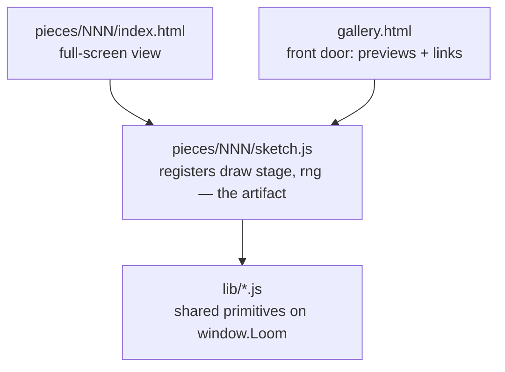

# Emil's Loom

A loom that weaves images in pure code. It's the SelfImprove loop's north star — a from-scratch generative-art engine and a gallery that grows one piece at a time.

Open `gallery.html` to see everything woven so far, or double-click any piece's `index.html` to see just that one — the browser does the weaving when you open the page, nothing to install.

Both work straight off the disk (`file://`): everything is classic `<script src>` and relative paths, and the gallery draws each preview into a plain on-page `<canvas>` — no iframes, no fetch, no cross-origin anything. (Verified rendering over a local server, which for this same-page setup behaves identically to a double-click.)

## Rate the pieces (Emil → the loop)

The gallery has a star rating under each piece. Tap the stars (they save in your browser), add notes, hit **Copy for the loop**, and paste into [`RATINGS.md`](RATINGS.md) — or just say it in chat. **The loop reads `RATINGS.md` before art-directing a new piece**, to steer palettes/forms toward what Emil actually likes. (A `file://` page can't write the file itself — hence copy-paste; same constraint as everything else here.)

## The one idea that shapes everything

**A piece is its generator code plus a seed — never a saved image.** When you open a piece, the browser runs the code and draws the result live. That's a deliberate choice:

- the repo stays text — diffable, light, no pile of binaries growing over 50 pieces;
- there's no from-scratch image encoder to build, the browser is the renderer;
- and because every piece draws its randomness from a **seeded** generator, the committed code reproduces the committed image *exactly*. Same seed, same cloth, every time.

Want to explore? Every piece has a "weave another" button that re-rolls the seed at view-time. The committed default seed is the one that makes the canonical version.

## How it's laid out

A piece registers a size-agnostic `draw(stage, rng)` with `Loom.piece({...})`. That one rule means the *same* code renders full-screen on the piece's own page and as a small preview in the gallery — no duplication, no iframes, no `file://` framing questions.

- `lib/` — the **primitives library**, the part that makes this compound. Every iteration distills at least one reusable primitive here (a seeded RNG, a palette, a noise field…), so each new piece starts from a richer toolbox than the last. Classic scripts on `window.Loom` (not ES modules — those don't load over `file://`).
- `pieces/NNN-name/` — one piece each. `index.html` is the double-clickable shell; `sketch.js` is the generator, kept separate so the art reads on its own.
- `gallery.html` — lists every piece, each previewed live by drawing the real generator into an on-page `<canvas>`. Add a piece with one `<script src>` line plus a row in its `CATALOGUE`.

## The library so far

- **`lib/rng.js`** — seeded PRNG (`Loom.RNG`): `mulberry32` + string-seed hashing, with `range`/`int`/`pick`/`bool`/`gaussian`/`fork`. *(primitive #1, iteration #4)*
- **`lib/palette.js`** — curated palettes (`Loom.palettes`, `Loom.palette(rng)`) + colour helpers `Loom.rgba(hex,a)`, `Loom.mix(a,b,t)`, `Loom.hexToRgb`. *(primitive #2, iteration #6)*
- **`lib/noise.js`** — seeded value noise: `Loom.noise(seed)` → `n(x,y)` in [0,1) with `n.fbm(x,y,octaves,lacunarity,gain)` for fractal detail. The workhorse for fields, terrains, textures, warping. *(primitive #3, iteration #11)*
- **`lib/points.js`** — `Loom.poisson(rng, w, h, r)`: Poisson-disk (blue-noise) point sampling — evenly-spaced-but-random points for Voronoi seeds, stippling, scattering, packing. *(primitive #4, iteration #12)*
- **`lib/lsystem.js`** — `Loom.lsystem(axiom, rules, n, rng)` (string rewriting, stochastic rules) + `Loom.turtle(str, opts, handlers)` (draw it: F/+/-/[/]). Plants, ferns, fractal curves. *(primitive #5, iteration #13)*
- **`lib/pack.js`** — `Loom.pack(rng, w, h, {minR,maxR,attempts,padding})`: circle packing (dart-throw + grow) → non-overlapping disks. Froth, aggregation, stipple-by-size. *(primitive #6, iteration #14)*
- **`lib/loom.js`** — the harness + the piece/preview contract: `Loom.piece({id,title,seed,draw})`, `Loom.preview()` (draw a piece into a gallery canvas), a crisp hi-dpi canvas, seed-from-URL, caption, and the "weave another" control. *(reworked to same-page previews in #5)*

## The pieces so far

- **001 — Warp & Weft** — vertical and horizontal threads crossing over and under, like cloth on a loom. The first thing it wove.
- **002 — Loose Threads** — the threads come loose: a few thousand drifting along an invisible current (a flow field). The deliberate opposite of the weave. Hit "weave another" to find its ember and violet moods.
- **003 — Strata** — a landscape from above: a noise field sliced into elevation bands and traced with contour lines, folded by domain warping like real rock. Built on `lib/noise.js`. The canonical seed is a pale survey-map; "weave another" finds ember-canyon and bathymetric-blue.
- **004 — Tessera** — the plane shatters into cells: a Voronoi mosaic on blue-noise seeds, coloured in regions by noise and traced with dark leading, like stained glass. Built on `lib/points.js` + `lib/noise.js`. Canonical seed is amethyst-and-gold (seed `42`).
- **005 — Bloom** — the first *grown* thing: stochastic L-system branches rising and blossoming at the tips, sized by measuring their bounding box. Built on `lib/lsystem.js`. Canonical seed `7` is warm autumn sprigs; "weave another" finds the cool blue-and-coral version.
- **006 — Roe** — round cells to Tessera's angular ones: hundreds of disks packed tight, large and tiny, shaded like glass beads. Built on `lib/pack.js`. Canonical seed `pearl` is jade-green; "weave another" finds amber and other beds.
